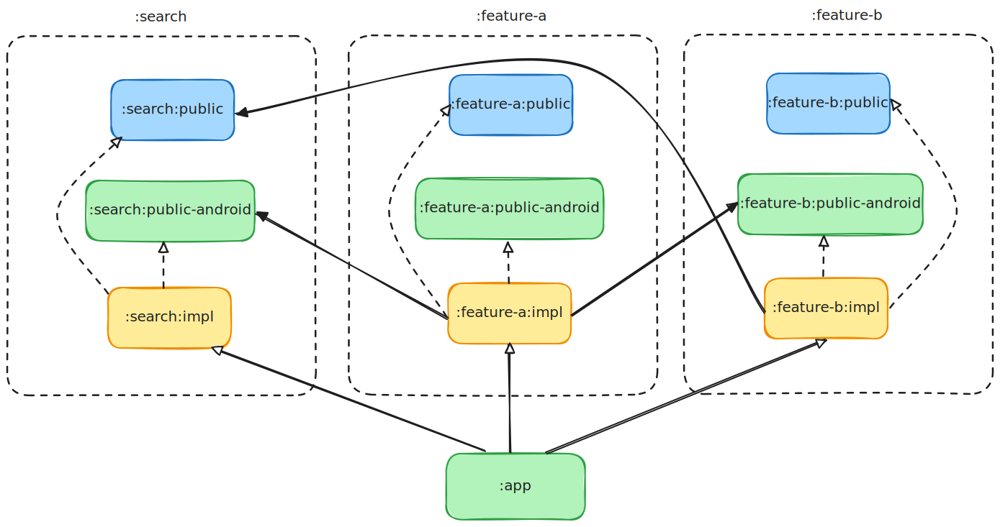

# Proposta: Clean Architecture & Modularização por Feature para Busca (Android)




## Visão Geral

Este repositório apresenta uma proposta de solução utilizando Clean Architecture e modularização por feature para implementar a funcionalidade de busca no aplicativo PicPay (Android, Kotlin).

- **Objetivo principal:** Demonstrar como estruturar a feature de busca em um app Android seguindo os princípios da Clean Architecture, dividindo responsabilidades em módulos distintos e de fácil manutenção.

## Arquitetura

- **Clean Architecture:** Separação em camadas (Apresentação, Domínio, Dados), promovendo testabilidade, escalabilidade e independência de frameworks.
- **Modularização por Feature:** Cada feature (ex: busca) é encapsulada em seu próprio módulo, facilitando o desenvolvimento, testes e escalabilidade de forma independente.

## Guias Visuais

- `module-diagram.svg`: Ilustra a estrutura modular do projeto.
- `searcher_module_arch-class-diagram.svg`: Mostra as relações entre classes e dependências dentro do módulo de busca.

## Como começar

1. **Clone o repositório:**
   ```bash
   git clone https://github.com/jonathangsilveira/proposal-clean-arch-search-feature-modularization-android.git
   ```
2. **Abra com o Android Studio.**
3. **Build & Run:** O projeto está configurado com Kotlin e Gradle.

## Estrutura do Projeto

- `app/`: Módulo principal do aplicativo.
- Módulos de feature (veja diagramas acima) organizados para separação de responsabilidades.

## Motivação

Aplicar Clean Architecture e modularização por feature ajuda times a entregar aplicativos Android robustos, escaláveis e fáceis de manter. Esta proposta é focada na feature de busca, mas os princípios podem ser reutilizados em outras partes do app.

## Autor

- [jonathangsilveira](https://github.com/jonathangsilveira)

---

> Para mais detalhes, explore os diagramas acima e veja a implementação dos módulos.